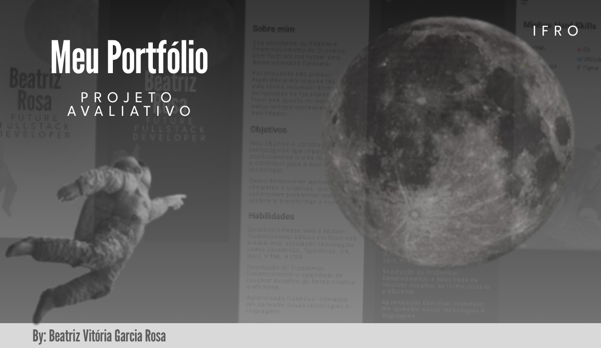

<h1 align="center">Meu Portfolio</h1>

Este projeto faz parte da avaliação da disciplina de Dispositivos Móveis.

  <a href="#-tecnologias">Tecnologias</a>&nbsp;&nbsp;&nbsp;|&nbsp;&nbsp;&nbsp;
  <a href="#-projeto">Projeto</a>&nbsp;&nbsp;&nbsp;|&nbsp;&nbsp;&nbsp;
  <a href="#-layout">Layout</a>&nbsp;&nbsp;&nbsp;|&nbsp;&nbsp;&nbsp;
  <a href="#memo-licença">Licença</a>

  

 

  

## 🚀 Tecnologias

Este projeto foi desenvolvido utilizando as seguintes tecnologias:

- Dart
- Flutter
- Git e GitHub
- Figma (para o design)

## 💻 Projeto

O "Meu Portfólio" é um aplicativo mobile desenvolvido como parte da avaliação da disciplina de Dispositivos Móveis. Ele serve como uma complementação ao desenvolvimento de aplicativos usando Flutter.

Se este for o seu primeiro projeto em Flutter, aqui estão alguns recursos úteis:

- [Lab: Escreva seu primeiro aplicativo Flutter](https://docs.flutter.dev/get-started/codelab)
- [Cookbook: Exemplos úteis em Flutter](https://docs.flutter.dev/cookbook)

Para mais detalhes sobre o desenvolvimento com Flutter, consulte a [documentação oficial](https://docs.flutter.dev/), que oferece tutoriais, exemplos, e uma referência completa da API.

## 🔖 Layout

Você pode visualizar o layout do projeto através [deste link](https://www.figma.com/design/MoYlnE5YoT3smQ39hEahZh/Meu-Portf%C3%B3lio?m=auto&t=95BvyqDM4pw0R4NS-1). É necessário ter uma conta no [Figma](https://figma.com) para acessá-lo.

## 📝 Licença

Este projeto está licenciado sob a licença MIT.

---

Feito com ♥
